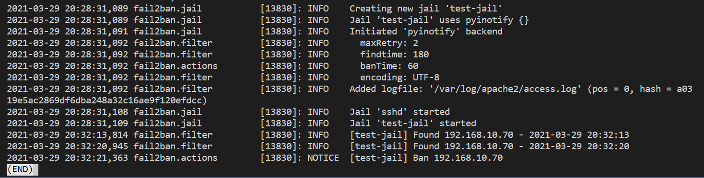
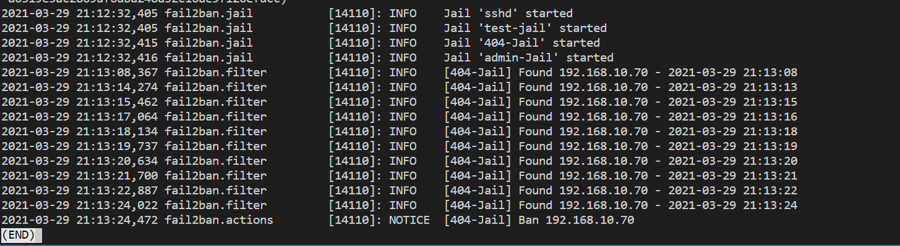
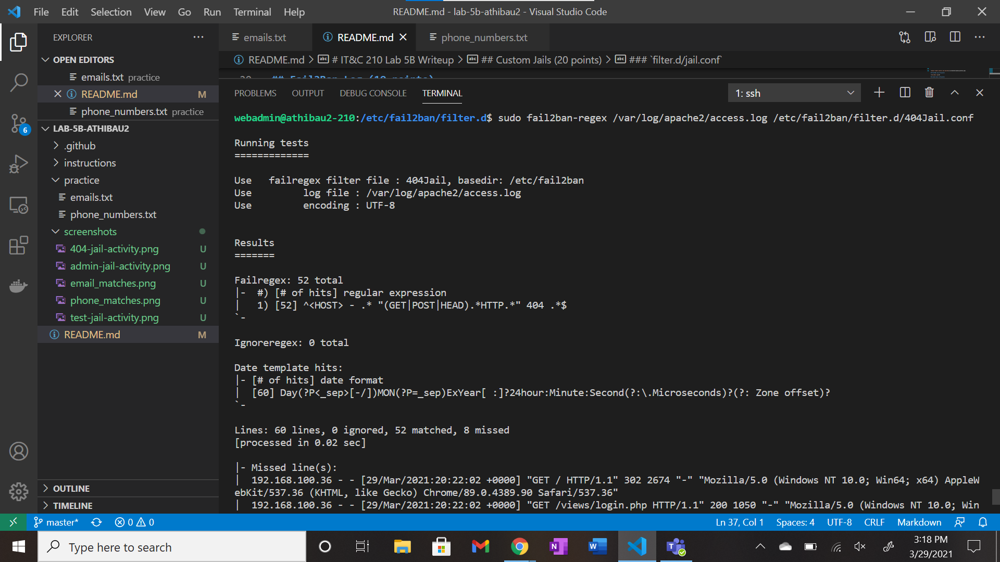
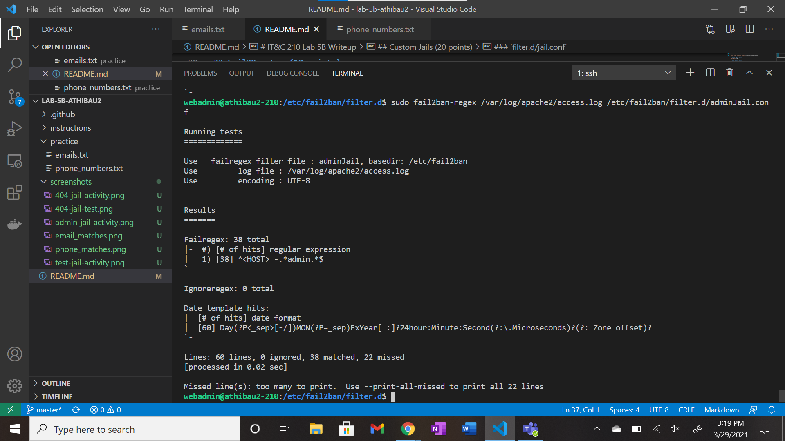

# <strong>IT&C 210 Lab 5B Writeup</strong>

__Name__: Andrew Thibaudeau
<br>


# <strong>Executive Summary</strong>
In this lab, I learned about regular expressions and server hardening. I got to write regular expression sequences to match certain emails and phone numbers, and apply them to the configuration files for the server jails I created.
<br>


# <strong>Design Overview</strong>
1. See screenshot below of regular expression sequence to find email matches.
2. See screenshot below to see the test jail ban activity. This shows the banned IP address.
3. See screenshot below to see the admin jail ban activity. This shows the banned IP address.
4. See screenshot below to see the 404 jail regex test. This shows the number of matched and missed lines.

### <strong>Files</strong>
1. <em>/etc/fail2ban/jail.local</em>
    * This file is where I added the most. I whitelisted my IP address so I wouldn't get banned. I also set up two custom jails, one for 404 errors and one for attempting to access admin on my live server. I added an action call to my admin jail.
2. <em>/etc/fail2ban/filter.d/404Jail.conf</em>
    * This file is where I wrote my regular expression for what my 404 jail is looking for.
3. <em>/etc/fail2ban/filter.d/adminJail.conf</em>
    * This is where I wrote my regular expression to catch when a user tries to access my live server with /admin on it.
4. <em>/etc/fail2ban/action.d/admin_notify.conf</em>
    * This is the configuration file where I wrote my trigger actions that will execute my python script. It is activated when an IP address is banned by the admin Jail.
5. <em>/home/webadmin/admin_notify.py</em>
    * This is my python script, where I wrote out the instructions to send an automatic email to myself whenever an IP address is banned.
<br>


# <strong>Questions</strong>


## Explore Regex (20 points)

### Emails

`/^[A-Za-z\d][A-Za-z\d\.\-\_]+@[A-Za-z\d]+[A-Za-z\d\-\.]*[A-Za-z\d\-]+(\.com|.org|.net|.int|.edu|.gov|.mil)$/gm`


### Phone Numbers

`/^(?!555)\d{3}\d{4}$|^(\d{3}(?!555)\d{3})\d{4}$|^(\d{3}\-)?(?!555)\d{3}\-\d{4}$/gm`


## Fail2Ban Log (10 points)

Test jail ban activity



## Custom Jails (20 points)

### `jail.local`

```conf
[404-Jail]
# Turns on the jail
enabled = true
# Only listen to port 80
port = 80
# Name of our test jail configuration file
filter = 404Jail
# Path to the log we will watch
logpath = /var/log/apache2/access.log
# Ban after 10 offenses
maxretry = 10
# The user will be banned for 60 seconds
bantime = 60
# Max retry counter will be reset to 0 after 60 seconds
findtime = 60

[admin-Jail]
# Turns on the jail
enabled = true
# Only listen to port 80
port = 80
# Name of our test jail configuration file
filter = adminJail
# Path to the log we will watch
logpath = /var/log/apache2/access.log
# Ban after 2 offenses
maxretry = 2
# The user will be banned for 60 seconds
bantime = 60
# Max retry counter will be reset to 0 after 180 seconds
findtime = 180
# Calls python script
action = %(action_)s
         admin_notify
```

### `filter.d/jail.conf`

```
404Jail.conf
[Definition]
failregex = ^<HOST> - .* "(GET|POST|HEAD).*HTTP.*" 404 .*$
ignoreregex =

adminJail.conf
[Definition]
failregex = ^<HOST> -.*admin.*$
ignoreregex =
```

...

## `fail2ban-regex` (10 points)

404 Jail ban activity


Admin Jail ban activity


404 Jail Regex Test


Admin Jail Regex Test



## Python script (40 points)

```Python
#!usr/bin/python3

import smtplib
from email.mime.text import MIMEText

# connect with Google's servers
smtp_ssl_host = 'smtp.gmail.com'
smtp_ssl_port = 465
# use username or email to log in
username = 'a.tihbs98@gmail.com'
password = 

from_addr = 'a.thibs98@gmail.com'
to_addrs = ['a.thibs98@gmail.com']

# the email lib has a lot of templates
# for different message formats,
# on our case we will use MIMEText
# to send only text
message = MIMEText('An unauthorized IP address has attempted to access the admin page and has been banned.')
message['subject'] = 'Admin Jail Activity Notification'
message['from'] = from_addr
message['to'] = ', '.join(to_addrs)

# we'll connect using SSL
server = smtplib.SMTP_SSL(smtp_ssl_host, smtp_ssl_port)
# to interact with the server, first we log in
# and then we send the message
server.login(username, password)
server.sendmail(from_addr, to_addrs, message.as_string())
server.quit()
```

This python script uses MIME (multipurpose internet mail extensions) to connect to the google mail server to send automated emails. It uses the credentials of a dummy email account to send an email over an SMTP object across that server. It logs in, sends the email by using the variables containing the subject, message, and to/from emails, and logs out/quits.

<br>

# <strong>Lessons Learned</strong>

1. <em>Sending an email from gmail</em>
    * Python's smtplib incorporates email servers for almost any email service. However, with Google, there are a couple extra steps. You need to make sure you import another email server; one example is to use MIME Text. You also need to use smtp.gmail.com as the ssl host to specify that you are using gmail instead of another service. The second step is to turn on the Google setting that allows less secure apps to access your Google account. By default, Google keeps this off, which will deny your script access.

2. <em>Python script naming</em>
    * There are a lot of files you need to create and edit to link custom jails to action configuration files to python scripts. One very important aspect of all of this is to have a consistent naming convention. Make sure you don't name any files something that will conflict with the system. For example, don't name your script "email.py", because that is the same name as a Python standard library module. Name it something else, and be mindful of possible issues like that.

3. <em>Regex: Excluding 555</em>
    * One requirement of the phone numbers regex is to make sure that exchange codes are never 555. Here is one way to do this: ([0-46-9]\d{2}|\d[0-46-9]\d|\d{2}[0-46-9]) <br>
    However, this is a very long, complex expression, and to copy it into multiple places in the total expression makes it very long and confusing. A much simpler way to do it is to use a negative look-ahead, which looks like this: (?!555)\d{3} <br>
    This does the same thing as the previous expression segment and makes it much cleaner and easy to read.
<br>


# <strong>Conclusions</strong>
1. Write regular expressions
2. Understand server jails and how IP banning works
3. Write custom jails
4. Configure jail action triggers
5. Write an automated Python script
<br>


# <strong>References</strong>
* https://humberto.io/blog/sending-and-receiving-emails-with-python/
* https://regex101.com/
* https://cheatography.com/davechild/cheat-sheets/regular-expressions/